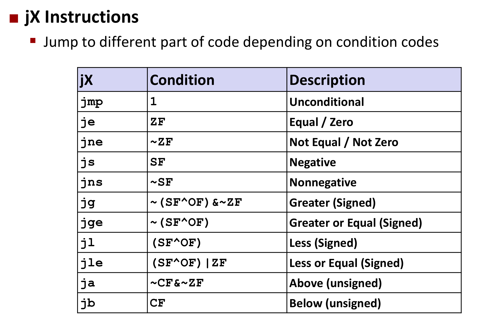
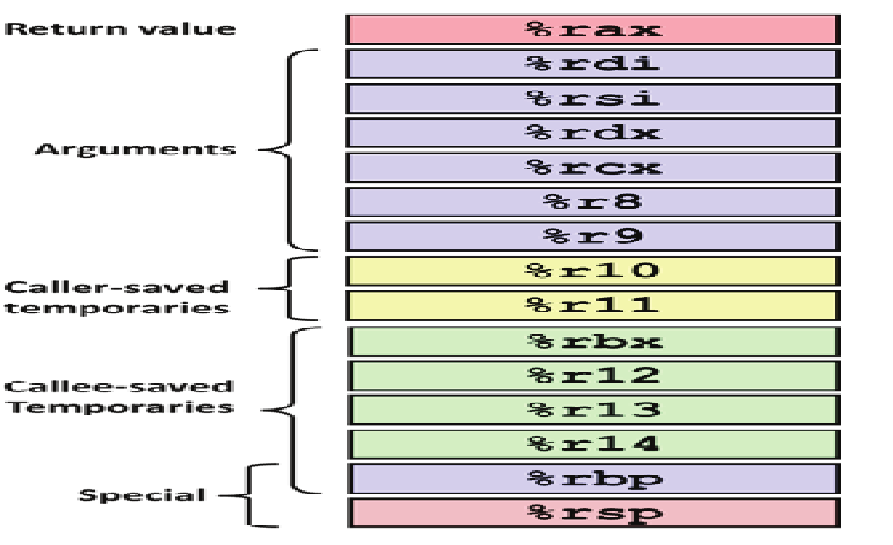

#### IEEE Floating Point

Form: $ (-1)^sM2^E $
$ s = \text{Sign Bit} $
$ M = \text{Significand} $ - Normally a fractional value in range $ [1.0, 2.0) $
$ E = \text{Exponent} $

##### Normalized values

When $ Exp \ne 000...0 \text{ and } Exp \ne 111...1 $

$$ E = Exp - Bias $$
$ Bias = 2^{k-1} - 1 $, k is number of exponent bits

M is coded with implied leading **1**: $ M = 1.xxx...x $ where $ xxx...x $are bits of frac field.

##### Denormalized values

When $ Exp = 000...0 $

$$ E = 1 - Bias $$

M is coded with implied leading **0**: $ M = 0.xxx...x $

##### Special values

When $ Exp = 111...1 $

If $ Frac = 000...0 $, it represents $ \infty $ **infinity**.
Occur when operation overflows.
It can be both positive and negative.

If $ Frac \ne 000...0 $, it represents NaN - Not-a-Number (case when no numeric value can be determined).
E.g. $ sqrt(-1) $, $ \infty * \infty $

Can almost use unsigned integer comparison.

- Must first compare the sign bit
- Must consider $ -0 = 0 $

##### FP Multiplication

If $ M \ge 2 $, shift $ M $ to right and increment $ E $.
If $ E $ out of range, overflow.
Round $ M $ to fit frac precision.

This is **not Associative**!! Due to overflow and inexactness of rounding.
$ (1e20 * 1e20) * 1e-20 = \infty, 1e20 * (1e20 * 1e-20) = 1e20 $

Multiplication might **not distribute over addition**.
$ 1e20 * (1e20-1e20) = 0.0, 1e20 * 1e20 - 1e20 * 1e20 = NaN $

##### FP Addition

$$ (-1)^{s1} M_1 2^{E1} + (-1)^{s2} M_2 2^{E2} $$
Let $ E1 > E2 $

Result: $ (-1)^s M 2^E $
$ E = E1 $

If $ M \ge 2 $, shift $ M $ right, increment $ E $.
If $ M < 1 $, shift $ M $ left $ k $ positions, decrement $ E $ by $ k $.
Overflow if $ E $ out of range
Round $ M $ to fit frac precision

This is **not Associative**!! Due to overflow and inexactness of rounding.
$ (3.14 + 1e10) - 1e10 = 0, 3.14 + (1e10 - 1e10) = 3.14 $

Big Endian: Sun, PPC Mac, Internet using it. Least significant byte has **highest address**.

Little Endian: x86, ARM processors running Android, iOS, and Windows. Least significant byte has **lowest address**.

Disks consists of platters, each with **two surfaces**
Each surface consists of concentric rings called **tracks**
Each track consists of **sectors** separated by gaps

Vendor expresses capacity in units of gagabytes (GB) where $ 1 GB = 10^9 bytes $.

$$ T_{access} = T_{avg seek} + T_{avg rotation} + T_{avg transfer} $$

Seek time ($ T_{avg seek} $): Time to position heads over cylinder containing target sector
Rotational latency ($ T_{avg rotation} $): Time waiting for first bit of target sector to pass under r/w head $ = 1/2 * 1/RPM * 60 sec/1 min (\text{for second}) $
Transfer time($ T_{avg transfer} $): Time to read the bits in the target sector `= 1/RPM * 1/(avg # sectors/track) * 60 sec/1 min`

`CF` - Carry Flag (for unsigned) - set if carry out from most significant bit (unsigned overflow)
`SF` - Signed Flag (for signed) - if $ result < 0 $
`ZF` - Zero Flag - if `t == 0`
`OF` - Overflow Flag (for signed) - if two's complement (signed) overflow

`cmp b, a` - like computing $ a - b $ without setting destination

`test b, a` - like computing $ a \& b $ without setting destination
Set `ZF` when `a & b == 0`
Set `SF` when `a & b < 0`

