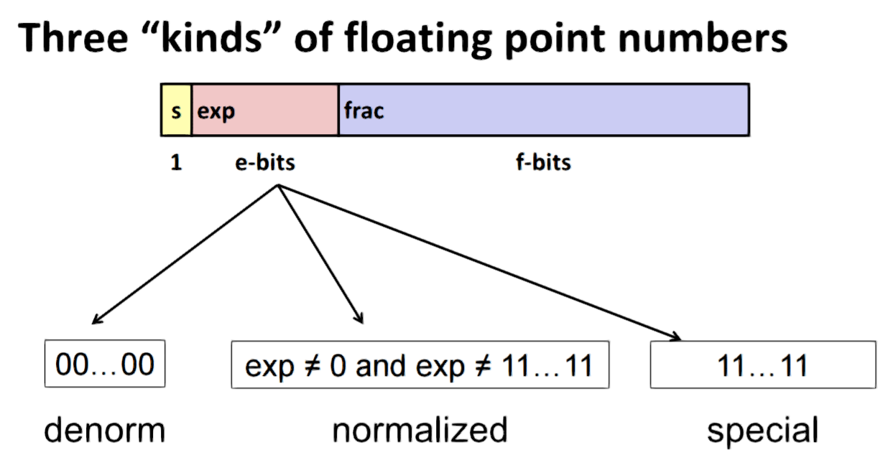

CMU 15-213 Summary
=====

[TOC]

## Number Representation

Number of bytes for C data types

| C Data Type | Typical 32 bit | Typical 64-bit | x86-64 |
|-------------|----------------|----------------|--------|
| char        |              1 |              1 |      1 |
| short       |              2 |              2 |      2 |
| int         |              4 |              4 |      4 |
| long        |              4 |              8 |      8 |
| float       |              4 |              4 |      4 |
| double      |              8 |              8 |      8 |
| pointer     |              4 |              8 |      8 |


#### Shift operation

Will be undefined with shift amount $ < 0 \text{ or } \ge \text{word size} $

##### Left Shift

`x << y` will fill `y` number of `0`s on right

##### Right Shift

`x >> y`
If logical shift, fill `y` number of `0`s on left
If arithmetic shift, replicate the most significant bit `y` times on left

#### Special numbers

|           Name           |            Number            |
|--------------------------|------------------------------|
| $ U_\{min\} (unsigned) $ | $ 0 $                        |
| $ U_\{max\} (unsigned) $ | $ 2^w -1 (111...1_2) $       |
| $ T_\{min\} (signed) $   | $ -2^\{w-1\} (100...0_2) $   |
| $ T_\{max\} (signed) $   | $ 2^\{w-1\} -1 (011...1_2) $ |
| $ -1 (signed) $          | $ (111...1_2) $              |

$ | T_{min} | = T_{max} + 1 $
$ U_{max} = 2 * T_{max} + 1 $

#### Addition

$ w $ bit number + $ w $ bit number = $ w + 1 $ bit number. However, we will simply drop the most significant bit to get $ w $.

Unsigned addition: If $ \text{true sum} \ge 2^w $, it will wrap around, but it will be **at most once**.

Signed addition: If $ sum \ge 2^{w-1} $, it will be negative, it will wrap around **at most once**. If $ sum \le -2^{w-1}-1 $, it will be positive, it will wrap around **at most once**.


#### Negative

For two's complement, `-x = ~x + 1` except for $ T_{min} $ which $ ~T_{min} + 1 = T_{min} $ due to overflow.

#### Multiplication

Unsigned: $ 2w $ bit result. Range: $ 0 \ge x * y \ge (2^w) $ TODO
Two's complement min (negative): $ 2w-1 $ bit result. Range: $ x * y \ge $ TODO
Two's complement max (positive): $ 2w $ bits, but only for $ T_{min_w}^2 $

### C Specific

#### Expanding (e.g. `short int` to `int`)
Unsigned: zeros added
Signed: sign extension

#### Truncating (e.g. `unsigned` to `unsigned short`)
Unsigned: `mod` operation (delete extra bits)
Signed: those extra bits are simply deleted. The sign of the number might be changed. `(short)0xFFFF == -1`


### Floating point numbers

#### Fractional Binary Numbers

Can only exactly represent numbers of the form $ x/2^k $. Other rational numbers have repeating bit representations.

Just one setting of binary point within the $ w $ bits -> limited range of numbers

#### IEEE Floating Point

Form: $ (-1)^sM2^E $
$ s = \text{Sign Bit} $
$ M = \text{Significand} $ - Normally a fractional value in range $ [1.0, 2.0) $
$ E = \text{Exponent} $




##### Normalized values

When $ Exp \ne 000...0 \text{ and } Exp \ne 111...1 $

$$ E = Exp - Bias $$
$ Bias = 2^{k-1} - 1 $, k is number of exponent bits

M is coded with implied leading **1**: $ M = 1.xxx...x $ where $ xxx...x $are bits of frac field.


##### Denormalized values

When $ Exp = 000...0 $

$$ E = 1 - Bias $$

M is coded with implied leading **0**: $ M = 0.xxx...x $

##### Special values

When $ Exp = 111...1 $

If $ Frac = 000...0 $, it represents $ \infty $ **infinity**.
Occur when operation overflows.
It can be both positive and negative.

If $ Frac \ne 000...0 $, it represents NaN - Not-a-Number (case when no numeric value can be determined).
E.g. $ sqrt(-1) $, $ \infty * \infty $ 


Can almost use unsigned integer comparison.

- Must first compare the sign bit
- Must consider $ -0 = 0 $
- And so on... TODO


##### Rounding Binary Numbers

When $ > 1/2 $ rounds up, $ < 1/2 $ rounds down.


##### FP Multiplication

If $ M \ge 2 $, shift $ M $ to right and increment $ E $.
If $ E $ out of range, overflow.
Round $ M $ to fit frac precision.

This is **not Associative**!! Due to overflow and inexactness of rounding.
$ (1e20 * 1e20) * 1e-20 = \infty, 1e20 * (1e20 * 1e-20) = 1e20 $

Multiplication might **not distribute over addition**.
$ 1e20 * (1e20-1e20) = 0.0, 1e20 * 1e20 - 1e20 * 1e20 = NaN $

##### FP Addition

$$ (-1)^{s1} M_1 2^{E1} + (-1)^{s2} M_2 2^{E2} $$
Let $ E1 > E2 $

Result: $ (-1)^s M 2^E $
$ E = E1 $

If $ M \ge 2 $, shift $ M $ right, increment $ E $.
If $ M < 1 $, shift $ M $ left $ k $ positions, decrement $ E $ by $ k $.
Overflow if $ E $ out of range
Round $ M $ to fit frac precision

This is **not Associative**!! Due to overflow and inexactness of rounding.
$ (3.14 + 1e10) - 1e10 = 0, 3.14 + (1e10 - 1e10) = 3.14 $

##### C Specific

`double/float` to `int`

- Truncates fractional part
- Like rounding toward zero
- Not defined when out of range or NaN -> generally sets to $ T_{min} $

`int` to `double`

- Exact conversion, as long as `int` has $ \le 53 $ bit word size

`int` to `float`

- Will round according to rounding mode

---------------


## Machine Structure

### Memory

Linux Memory Layout


#### Stack smashing attacks
- Overwrite normal return address by some value
- Making the function returns to code that it wasn't supposed to be jumped to

#### Code injection attacks
- Input string contains byte representation of executable code
- Overwrite return address A with address of buffer B
- When Q executes `ret`, will jump to exploit code

##### Randomized stack offsets
- Shifts stack addresses for entire program
- At start of program, allocate random amount of space on stack
- Making hacker hard to predict beginning of inserted code

##### Non-executable code segents
- Stack marked as non-executable


##### Stack Canaries
- Place special value "canary" on stack just beyond buffer
- Check for corruption before exiting function

##### Return-oriented programming attacks
- doesn't overcome stack canaries
- craft the stack such that it execute existing code in a sequence to achieve desired result
    + sequence of instructions ending in `ret` (byte: `0xC3`)
    + it works because code positions are fixed from run to run
    + we can repurpose byte code


#### Byte order convention

Big Endian: Sun, PPC Mac, Internet using it. Least significant byte has **highest address**.

Little Endian: x86, ARM processors running Android, iOS, and Windows. Least significant byte has **lowest address**.

#### Random-Access-Memory (RAM)

Basic storage unit is normally a **cell** (one bit per cell).

Different Double Data-Rate Synchronous DRAM (DDR SDRAM) types are distinguished by size of small prefetch buffer - DDR (2 bits), DDR2 (4 bits), DDR3 (8 bits)

### Bus

A bus is a collection of parallel wires that carry address, data, and control signals.
Buses are typically shared by multiple devices.

### Disk

Disks consists of platters, each with **two surfaces**
Each surface consists of concentric rings called **tracks**
Each track consists of **sectors** separated by gaps
Rotation is counter-clockwise.

#### Recording zones
- Neighbouring tracks are grouped together into a zone
- Each track in a zone has the same number of sectors, determined by the circumference of innermost track.
- Outer zones have more sectors/track than inner zones.
- We use average number of sectors/track when computing capacity

#### Capacity
- The capacity of a disk is the maximum number of bits that can be stored.
- Vendor expresses capacity in units of gagabytes (GB) where $ 1 GB = 10^9 bytes $.
- Capacity is determined by:
    + Recording density ($ bits/in $)
    + Track density ($ tracks/in $)
    + Areal density ($ bits/in^2 $)
- Capacity = (# bytes/sector) * (avg # sectors/track) * (# track/surface) * (# surface/platter) * (# platter/disk)

#### Disk Access Time

$$ T_{access} = T_{avg seek} + T_{avg rotation} + T_{avg transfer} $$

Seek time ($ T_{avg seek} $): Time to position heads over cylinder containing target sector
Rotational latency ($ T_{avg rotation} $): Time waiting for first bit of target sector to pass under r/w head $ = 1/2 * 1/RPM * 60 sec/1 min (\text{for second}) $
Transfer time($ T_{avg transfer} $): Time to read the bits in the target sector $ = 1/RPM * 1/(avg # sectors/track) * 60 sec/1 min $

### Memory Hierarchy

Fundamental Idea: For each $ k $, the faster, smaller device at level $ k $ serves as a cache for the larger, slower device at level $ k + 1 $.

Big Idea: Create a large pool of storage that costs as much as the cheap storage near the bottom, but that serves data to programs at the rate of the fast storage near the top.

Because of locality, programs tend to access the data at level $ k $ more often than they access the data at level $ k + 1 $.


#### Spatial locality

Space near the space accessed before would be more likely to be accessed

#### Temporal locality

Space that accessed before would be more likely to be accessed again

#### Cache

##### Placement policy

determines where b goes

##### Replacement policy

determines which block gets evicted

##### Cache misses

Cold (compulsory) miss: because specific part of cache is empty
Conflict miss: When the cache is large enough but multiple data objects all map to the same block in cache
Capacity miss: Occurs when the set of active cache blocks is larger than the cache

##### Writes

If write-hit:

- Write-through (write immediately to memory)
- Write-back (defer write to memory until replacement of line)
    + need a dirty bit to memorize whether line is different from memory

If write-miss:

- Write-allocate (load into cache, update line in cache)
    + Good if more writes the location follow
- No-write-allocate (writes straight to memory, doesn't load into cache)

##### Cache performance metrics
- Miss rate
    + Fraction of memory references not found in cache (misses/accesses) = 1 - hit rate
- Hit time
    + Time to deliver a line in the cache to the processor including time to determine whether the line is in the cache
- Miss penalty
    + Additional time required because of a miss


##### General Cache Organization (S, E, B)


Generally address of word is interpreted in this way to locate the cache


### Registers


Temporary data: (`%rax`, `%rbx`....)
Location of runtime stack: (`%rsp`)
Location of current code control point: (`%rip`...)
Status of recent tests: (`CF`,`ZF`,`SF`,`OF`)

`CF` - Carry Flag (for unsigned) - set if carry out from most significant bit (unsigned overflow)
`SF` - Signed Flag (for signed) - if $ result < 0 $
`ZF` - Zero Flag - if `t == 0`
`OF` - Overflow Flag (for signed) - if two's complement (signed) overflow `(a > 0 && b > 0 && t < 0) || (a < 0 && b < 0 && t >= 0)`

However, those are not set by `lea`

#### SSE3 XMM Floating point registers

16 registers in total, each 16 bytes

They are all caller-saved

Arguments are passed in `%xmm0, %xmm1, ....`
Result returned in `%xmm0`

However, pointer to FPs will be passed in regular registers.

### Stack

Stack top has the lowest address. When we push/pop, we put/get the stack stop data.

`%rsp` = address of stack top
`%rbp` = address of stack bottom

### Assembly

#### Common Instructions

For integers

|   Name   |                      Description                       |
|----------|--------------------------------------------------------|
| mov A,B  | assign A to location B                                 |
| lea A,B  | evaluate the address of A then assign the address to B |
| add A,B  | $ B = A + B $                                          |
| sub A,B  | $ B = B - A $                                          |
| imul A,B | $ B = A * B $                                          |
| sal A,B  | $ B = B << A $                                         |
| sar A,B  | $ B = B >> A $                                         |
| xor A,B  | $ B = A \oplus B $                                     |
| and A,B  | $ B = A \& B $                                         |
| or A,B   | $ B = A \text\{ or \} B $                              |
| inc A    | $ A++ $                                                |
| dec A    | $ A- - $                                               |
| neg A    | $ A = -A $                                             |
| not A    | $ A = \text\{bit invert \} A $                         |


For FPs

|   Name  |              Description              |
|---------|---------------------------------------|
| addss   | scalar add: single precision (float)  |
| addsd   | scalar add: double precision (double) |
| ucomiss | Compare single precision              |
| ucomisd | Compare double precision              |

Instruction suffixes

| suffix |                       Description                        |
|--------|----------------------------------------------------------|
| b      | byte (8 bit)                                             |
| s      | short (16 bit integer) or single (32-bit floating point) |
| w      | word (16 bit)                                            |
| l      | long (32 bit integer or 64-bit floating point)           |
| q      | quad (64 bit)                                            |
| t      | ten bytes (80-bit floating point)                        |
| ss     | Scalar operation: Single precision (float)               |
| sd     | Scalar operation: Double precision (double)              |


#### Conditional Instructions

##### cmp b, a

like computing $ a - b $ without setting destination

Set `CF` if carry out from most significant bit (used for unsigned comparisons)
Set `ZF` if `a == b`
Set `SF` if `(a-b) < 0` (as signed)
Set `OF` if two's complement (signed) overflow

##### test b, a

like computing $ a \& b $ without setting destination

Set `ZF` when `a & b == 0`
Set `SF` when `a & b < 0`

##### set


#### Jumping


#### Stack instructions

##### `pop`

Pop a value from memory.
The memory didn't change but the `%rsp` will be increased by the size of the data popped.

#### Procedure Call


Each procedure has its own stack frame used to store return information, local storage(if necessary), and temporary storage (if necessary)

##### `call label`

Push return address on stack.
Jump to `label`

##### `ret`

Pop address from stack.
Jump to address.

##### Temporary state save
- Caller Saved
    + Caller saves temporary values in its frame before the call
    + 
- Callee Saved
    + Callee saves temporary values in its frame before using
    + Callee restores them before returning to caller
    + 

#### Operand types

##### Immediate

Constant integer data
it is prefixed with `$` encoded with **1, 2, or 4 bytes** (can't do 8 bytes)

##### Register

prefixed with `%`

##### Memory

The address is surrounded by `(` and `)`.
We can't do memory to memory transfer with a single instruction.

$$ D(R_b, R_i, S) = Mem[Reg_{R_b} + S * Reg_{R_i} + D] $$
$ D $: Constant displacement (1, 2, or 4 bytes)
$ R_b $: Base register (Any of 16 integer registers)
$ R_i $: Index register (Any, except for `%rsp`)
$ S $: Scale (1, 2, 4, or 8)

## C Specific

### Linking


This enables:

- Modularity
    + Programs can be written as a collection of smaller source files, rather than one monolithic mass
- Efficiency
    + Time
        * separate compilation
        * you only need to recompile the source file that you changed instead of recompiling all of them again
        * can compile multiple files concurrently
    + Libraries
        * Static Linking
            - Executable files and running memory images contain only the library code they actually use
        * Dynamic Linking
            - Executable files contain no library code
            - During execution, single copy of library code can be shared across all executing processes

#### Library Interpositioning

Powerful linking technique that allows programmers to *intercept calls* to arbitrary functions. This can occur at *Compile time*, *Link time*, *Load/run time*.


#### Steps

##### Step 1: Symbol resolution

Programs define and reference symbols (global variables and functions). Like 
`void swap() {...} // Define symbol swap`
`swap(); // Reference symbol swap`
`int *xp = &x; // Define symbol xp, reference x`

Symbol definitions are stored in object file (by assembler) in symbol table.
Symbol table is an array of entries.
Each entry includes name, size and location of symbol.

The linker *associates* each symbol reference with *exactly one* symbol definition.

##### Step 2: Relocation
- Merge separate code and data sections into single sections
- Relocates symbols from their relative locations in the `.o` files to their final absolute memory locations in the executable
- Update all references to these symbols to reflect their new positions


##### Linker Program Symbols

***Global Symbols***

- Symbols defined by a particular module that can be referenced by other modules
- non-`static` C functions and global variables


***External Symbols***

- Global symbols that are referenced by a module but defined by some other module


***Local Symbols***

- Symbols that defined and referenced exclusively by a module
- E.g. C functions and global variables defined with the `static` attribute
- Local variables (e.g. the ones in functions) are not local linker symbols

***Strong Linker Program Symbols***

They are Procedures and initialized globals.

Multiple strong symbols with the same name are not allowed.

***Weak Linker Program Symbols***

They are uninitialized globals.

If we have a strong symbol and multiple weak symbols, the weak symbols will be referenced to the strong symbol.

If there are all weak symbols, they will all referenced to one of them.
If they are of different type, memory corruption might happen.


#### Files

##### Relocatable object file (`.o` file)

Contains code and data in a form that can be combined with other relocatable object files to form executable object file.
Each `.o` file is produced from exactly one source (`.c`) file

##### Executable object file (`a.out` file)

Contains code and data in a form that can be copied directly into memory and then executed.

##### Shared object file (`.so` file)
- Special type of **relocatable object file** that can be loaded into memory and linked ***dynamically***, at either load time or run-time.
- Called **Dynamic Link Libraries (DLLs)** by Windows
- They are linked *dynamically* at either *load-time* or *run-time*
    + In Linux, it's done by calling `dlopen()` interface
- Will be distributed separated from the executable


##### Static libraries (`.a` archive files)
- Concatenate related relocatable object files into a single file with an index (called an archive)
- If an archive member file resolves reference, link it into the executable
- Archiver allows incremental updates
- Linker's algorithm for resolving external references
    + Scan `.o` files and `.a` files in the *command line order*
        * Therefore, the order matters
    + During the scan, keep a list of the current unresolved references
    + As each new `.o` or `.a` file, `obj`, is encountered, try to resolve each unresolved reference in the list against the symbols defined in `obj`
    + If any entries in the unresolved list at end of scan, then error
- At the end, its content will be bundled in the executable


### Union
- Provide different interpretation of the same data
- Allocate according to largest element
- Can only use one field at a time

E.g.
```c
union Data {
   int i;
   float f;
   char str[20];
} data;
```

## Data Structure

### Page Table

A page table is an array of page table entries(PTEs) that maps virtual pages to physical pages.


### ELF Object File Format


## Virtual Memory

When $ \text{working set size} < \text{main memory size} $, we get good performance for one process after compulsory misses.

When $ Sum(\text{working set sizes}) > \text{main memory size} $, pages are swapped (copied) in and out continuously.


### Advantage
- Uses main memory efficiently
    + Use DRAM as a cache for parts of a virtual address space
    + Read-only library code can be shard among processes
- Simplifies memory management
    + Each process gets the same uniform address space
    + Processes can view memory as a simple linear array
- Isolates address spaces
    + One process can't interfere with another's memory
    + User program can't access privileged kernel information and code
- Well-chosen mappings can improve locality

### Terminology
- **Page Hit**: Reference to VM word that is in physical memory (DRAM cache hit)
- **Page Fault**: Reference to VM word that is not in physical memory (DRAM cache miss)
    + When this happens, it will wait until the requests page loaded to DRAM

### VM as a tool for memory protection
- Extends PTEs with permission bits
- MMU checks these bits on each access

### Memory Management Unit (MMU)
- An unit for adding virtual memory support
- **Translation lookaside buffer** can be added to speed up translation (instead of only using DRAM/CPU cache to do the job)
    + small set-associative hardware cache in 

## Exceptional Control Flow

### System call

Similar to normal function call, except for:

- Address of the function is in `%rax`
- Different set of privileges
- Executed by Kernel

## I/O

A Linux file is a sequence of bytes.
All I/O devices are represented as files.

### File Types

***Regular file***: Contains arbitrary data

**Text file**: Contains only bytes that is meant to be decoded by a certain charset

***Directory***: Index for a related group of files

Each directory contains at least two entries.
`.` is a link to itself
`..` is a link to the parent directory in the directory hierarchy


***Socket***: For communicating with a process on another machine

### Functions

#### `stat`, `fstat`

#### `opendir`, `readdir`, `closedir`

Get the metadata of files.

#### Text-oriented I/O

They will interpret the EOL character (newline).

#### Lower level Unix I/O functions

***Pros***
- The most general and lowest overhead form of I/O
    + All other I/O packages are implemented using Unix I/O function
- Provide functions for accessing file metadata
- They are async-signal-safe and can be used safely in signal handlers

***Cons***
- Dealing with short counts is tricky and error prone
- Efficient reading of text lines requires some form of buffering
- Both of these issues are addressed by the standard I/O and RIO packages

#### Standard I/O

***Pros***
- Buffering increases efficiency by decreasing the number of `read` and `write` system calls
- Short counts are handled automatically

***Cons***
- Provides no function for accessing file metadata
- They are not async-signal-safe, and not appropriate for signal handlers
- They are not appropriate for input and output on network sockets


## Networking

Nowadays, networking is using IP protocol.

***IPv4***
We mainly focus on IPv4.
Hosts are mapped to a set of 32-bit IP address. The upper bound is `255.255.255.255`. 

***IPv6***
128-bit addresses.


### Misc

#### URL

A type of Uniform Resource Identifier (URI).

#### MIME types

Used by HTTP protocol. Used to specify the type of the content that is being transferred.

#### Connected VS Listening Descriptors

***Listening descriptor***
- End point for client connection requests
- Created just once for each service

***Connected descriptor***
- End point of the **connection** between client and server
- Namely, one for each connection

### Terminology
- **Router**: Connect different incompatible LANs together
    + it is a bridge
- **Packet**: A standard transfer unit contains *header* and *payload*
    + **Header**: Contains information such as *packet size*, *source* and *destination addresses*
    + **Payload**: Contains data bits sent from source host
- **Socket**: an endpoint of a connection
    + It is in a form to file descriptor in programs
- **Port**: a 16-bit integer
    + **Ephemeral port**: Assigned automatically by client kernel when client makes a connection request
    + **Well-known port**: Associated with some service provided by a server
- **Loopback Address**: Used to access the service on the same machine
- **Internet backbone**: Collection of routers connected by high-speed point-to-point networks
- **Internet Exchange Points (IXP)**: Router that connects multiple backbones
    + Also called **Network Access Points (NAP)**
- **Regional networks**: smaller backbones that cover smaller geographical areas
- **Point of presence (POP)**: machine that is connected to the Internet
- **Internet Service Providers (ISPs)**: provide dial-up or direct access to POPs

### Protocols

#### IP (Internet Protocol)

Provides basic naming scheme and unreliable delivery capability of packets (datagrams) from **host-to-host**

#### UDP (Unreliable Datagram Protocol)

Uses IP to provide unreliable datagram delivery from **process-to-process**

#### TCP (Transmission Control Protocol)

Uses IP to provide reliable byte streams from **process-to-process** over **connections**

#### HTTP (HyperText Transfer Protocol)

***Static content***

Content stored in files and retrieved in response to an HTTP request


***Dynamic content***

Content produced on-the-fly in response to an HTTP request

Newline character is `\r\n`.
Must end with a blank line.

***CGI***

The original standard for generating dynamic content. Has been largely replaced by other, faster techniques.

request arguments are passed to child by environment variable `QUERY_STRING`
output to client just writes to `stdout`

Child must generate headers for `Content-length` and `Content-type` since only he knows it.

***GET request***

argument list starts with `?`
arguments separated by `&`
spaces represented by `+` or `%20`

***Difference between HTTP/1.0 and HTTP/1.1***
- `HTTP/1.0` uses a new connection for each transaction
- `HTTP/1.1` supports persistent connections
    + multiple transactions over the same connection
    + specify by header `Connection: Keep-Alive`
- `HTTP/1.1` requires `HOST` header
    + `Host: www.cmu.edu`
    + Makes it possible to host multiple websites at single Internet host
- `HTTP/1.1` supports chunked encoding
    + `Transfer-Encoding: chunked`
- `HTTP/1.1` adds additional support for caching

**Chunked**
- break into blocks
- prefix each block with number of bytes

### Connection
- Uniquely identified by the socket addresses of its endpoints (socket pair)

### Functions

***`getaddrinfo`***
- Reentrant
- Thread-safe
- Protocol Independent
- Return values includes a linked list which contains a bunch of addrinfo structs that are corresponds to the information given.


***`getnameinfo`***
- Reentrant
- Protocol Independent
- Returns the host(name) information by addrinfo

***`bind`***
- Ask the kernel to associate the server's socket address with a socket descriptor

***`listen`***
- The socket supplied to `listen` should be **active**.

***`accept`***
- Wait for connection request to arrive on the connection bound to `listenfd`, then it returns with client `addr` filled in
- Return a **connection descriptor** used to read the data from client


***`connect`***
- connects to a server
- return socket for read/write with the server


### Linux Specific
- `/etc/services` has mapping between well-known ports and service names

## Program Execution

### Context Switching
Processes are managed by a shared chunk of memory-resident OS code called the *kernel*. Control flow passes from one process to anther via a *context switch*.

### States

***Running***
Process is either executing, or waiting to be executed and will eventually be scheduled by the kernel.

***Stopped***
Process execution is suspended and will not be scheduled until further notice

***Terminated***
Process is stopped permanently


## Linux Programs

### `strace`

Trace system calls and signals

## Parallel Programming

### Terminology

***Process***
An instance of a running program.

*NOTE: children process doesn't rely on parent to live*

**Zombie Process**
Process that is terminated but still has information (e.g. exit status) stored.

If its parent terminates without having its children information reaped, `init` will reap.

***Reentrant***
Means something can be interrupted and resumed later without problem.

***Deadlock***
A deadlock is a state in which each member of a group of actions, is waiting for some other member to release a lock.

***Livelock***
A livelock is similar to a deadlock, except that the states of the processes involved in the livelock constantly change with regard to one another, none progressing.

***Starvation***
Resources are kept being freed and acquired. But, some threads can never get the resource to advance.


***Races***
Outcome depends on arbitrary scheduling decisions elsewhere in the system.

### Types
- **Process-based**
    + Kernel automatically interleaves multiple logical flows
    + Each flow has its own private address space
    + The overhead is big to create processes
    + Data sharing between processes is hard
- **Event-based**
    + Programmer manually interleaves multiple logical flows
    + All flows share the same address space
    + Uses technique called I/O multiplexing
    + Server maintains set of active connections
    + Can't take advantage of multi-core
        * Single thread of control
    + No process or thread control overhead
    + harder to code
- **Thread-based**
    + Kernel automatically interleaves multiple logical flows
    + Each flow shares the same address space

### Amdahl's Law

$ T $ - Total sequential time required

$ p $ - Fraction of total that can be speed up ($ \le p \le 1 $)

$ k $ - speed up factor

$ \text{Result performance} T_k = \frac{pT}{k} + (1-p)T $

Maximum possible speed up

$ k = \inf $
$ T_{\inf} = (1-p)T $

### Functions

***`fork()`***

- Create a process that will run the instruction that is right after the `fork()` invocation
- New process inherits all **file descriptors**, **uid**, **gid** from the parent process
    + Therefore, it's important to close all those unneeded file descriptors in the child process
- Get an identical copy of the parent's virtual address space
- Return 0 on child process, `pid` of the child on parent process
- Linux specific
    + child process shares same space with parent with Copy-on-write enabled

***`wait(int *child_status)`***

- Suspends current process until *one of its children terminates*

***`waitpid(pid_t pid, int *status, int options)`***

- Suspends current process until specific process terminates
- If `pid == -1`, it waits for arbitrary child

***`execve(char *filename, char *argv[], char *envp[])`***

- `envp` is an array of string in form of `name=value`
- This will execute the target program which overwrites *code*, *data*, and *stack*
- This retains *PID*, *open files*, and *signal context*

***`mmap(void *start, int len, int prot, int flags, int fd, int offset)`***

- if `start == 0`, may be `0` for "pick an address"

***pthread_create***
***pthread_join***
***pthread_self***
***pthread_detach***

- Tells pthread that no thread gets information about the thread
- Reaped automatically (by kernel) when it terminates

***pthread_cancel***
***pthread_exit***
***pthread_mutex_init***
***pthread_mutex_[un]lock***

### Memory Consistency

#### Sequential Consistency

Overall effect consistent with each individual thread.
In other words, each thread executes in proper order.

### Thread
- Each shares same code, data, and kernel context
- Each has its own logical control flow
- Each has its own stack for local variables
    + But, no protection between them
    + A variable `x` is shared $ \iff $ more than one threads can reference to `x`
- Each thread has its own thread id
- Two threads are concurrent if their flows overlap in time
- Each thread has its own separate thread context


#### Thread context
- Thread ID
- Stack
- Stack pointer
- PC
- condition codes
- GP registers

#### Variable sharing

|          Type          |         Sharing?        |
|------------------------|-------------------------|
| Global variables       | Sharing between threads |
| Local variables        | Sharing between threads |
| Local static variables | Sharing between threads |

`volatile` keyword in C specifies that optimizer must not optimize away the subsequent reads or writes. It means 


##### False sharing

Threads write to data in the same cache block will invalidate each other's cache.


#### Synchronization
- This is needed when operations on some variable need exclusive access
- Terminology
    + `Binary Semaphore`: semaphore whose value is always 0 or 1
    + `Mutex`: binary semaphore used for mutual exclusion
        * `P`: **locking** the mutex
        * `V`: **unlocking/releasing** the mutex
        * **holding** a mutex: locked and not yet unlocked
    + `Counting Semaphore`: Used as a counter for a set of available resources
- Methods
    + Semaphores
        * the initial `s` value determines how many threads can enter the critical region concurrently
        * Operations
            - `P(s)`
                + if `s` is nonzero, decrement `s` by `1` and return immediately
                + if `s == 0`, suspend thread until `s` becomes nonzero
            - `V(s)`
                + increment `s` by `1`
                    * must increase atomically
        * Invariant: `s >= 0`
## Misc
- Each x86-64 system call has a unique ID number


Mid Term Special Notes
=====

## C specific
$ 1U $ is an unsigned integer $ 1 $
When mix signed and unsigned, signed values will be cast to unsigned implicitly **including comparison operations**.
Bit pattern is maintained while casting between signed and unsigned, it only differs in interpretation.


The fields of struct in C will be placed in memory according to declaration.
Offsets of accessing memories are determined in compile time.

Fields need to align with 4 or 8 bytes in order to access.
Compilers will insert gaps to ensure correct alignment.

Special cases of alignment (x86-64)

2 bytes: short
    lowest 1 bit of address must be $ 0_2 $
4 bytes: short
    lowest 2 bit of address must be $ 00_2 $
8 bytes: short
    lowest 3 bit of address must be $ 000_2 $

Structures must have alignment $ K $ where $ K = \text{ largest alignment of any element } $.
Initial address and structure length must be multiples of $ K $.
`sizeof(a_struct)` will include the alignment spacers.

To save space, we should put large data types first.

